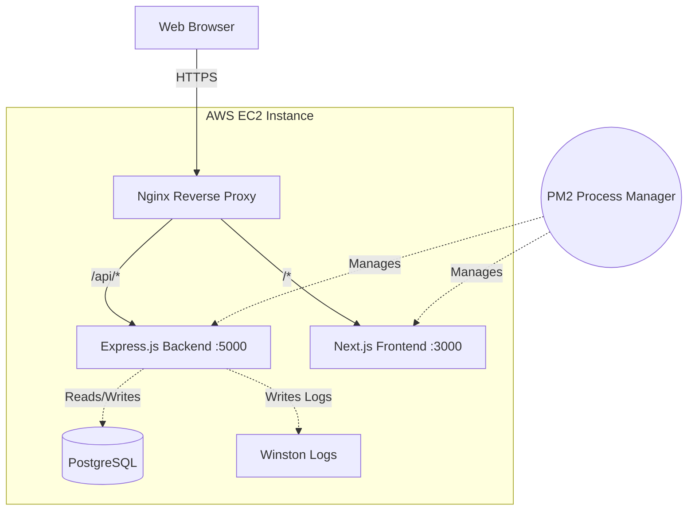
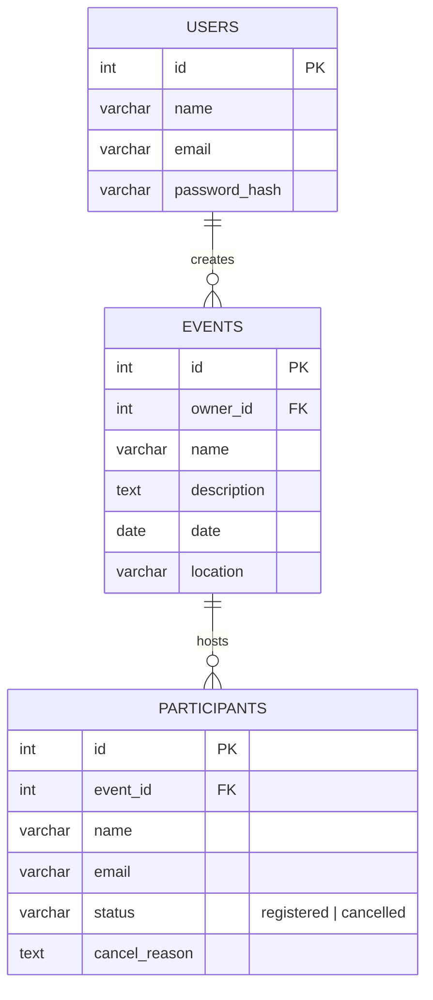

# System Design Document: Event Manager Dashboard

## High-Level Architecture

The system uses a classic 3-tier architecture:
1. **Presentation Layer**: Next.js (App Router)
2. **Application Layer**: Express.js REST API
3. **Data Layer**: PostgreSQL Database

## Component Design

### Frontend (Next.js)
- **App Router**: Used for optimal Server-Side Rendering (SSR) and SEO on public pages (like Event Details).
- **Client Components**: Used for interactive pieces (Forms, Dashboard, Search).
- **Debouncing**: Implemented on the search bar to minimize API calls.
- **Centralized API Client**: Axios instance intercepts requests to attach JWTs and globally handles 401 Unauthorized responses.

### Backend (Express.js)
- **Raw SQL Strategy**: Uses connection pooling via `pg`. Queries are protected from SQL Injection using parameterized inputs (`$1, $2`).
- **Authentication**: JWT tokens stored in localStorage. Passwords hashed using `bcryptjs`.
- **Validation**: Strict schema validation using `Zod` in custom middleware. Invalid requests never reach the controller.
- **Logging**: `Winston` with `morgan` generates daily rotating log files. Every request is tagged with a UUID (`X-Request-Id`) for traceability.
- **Rate Limiting**: Defends against DDoS and brute force. Global limit (100 req/15min) and strict mutation limit (20 req/15min).

## Database Schema (ERD)

## Scalability & Future Improvements
Currently, this is a monolithic deployment suitable for low-to-medium traffic.
To scale:
1. **Separate DB**: Move PostgreSQL to AWS RDS (Multi-AZ).
2. **Horizontal Scaling**: Put the EC2 instances behind an AWS Application Load Balancer (ALB).
3. **Caching**: Introduce Redis to cache frequent queries (e.g., event listing) and to back the rate limiter.
4. **CDN**: Serve static assets via CloudFront.
